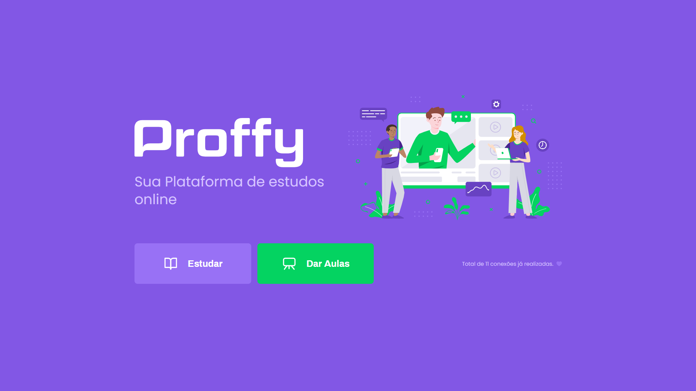
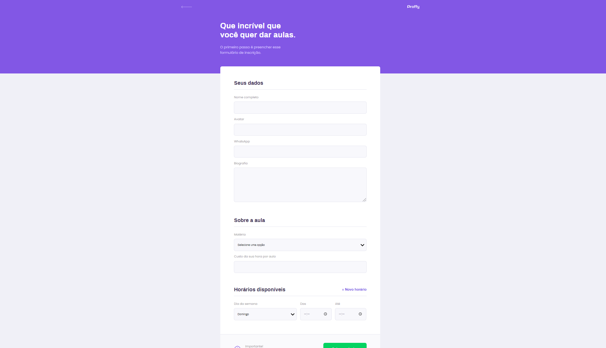
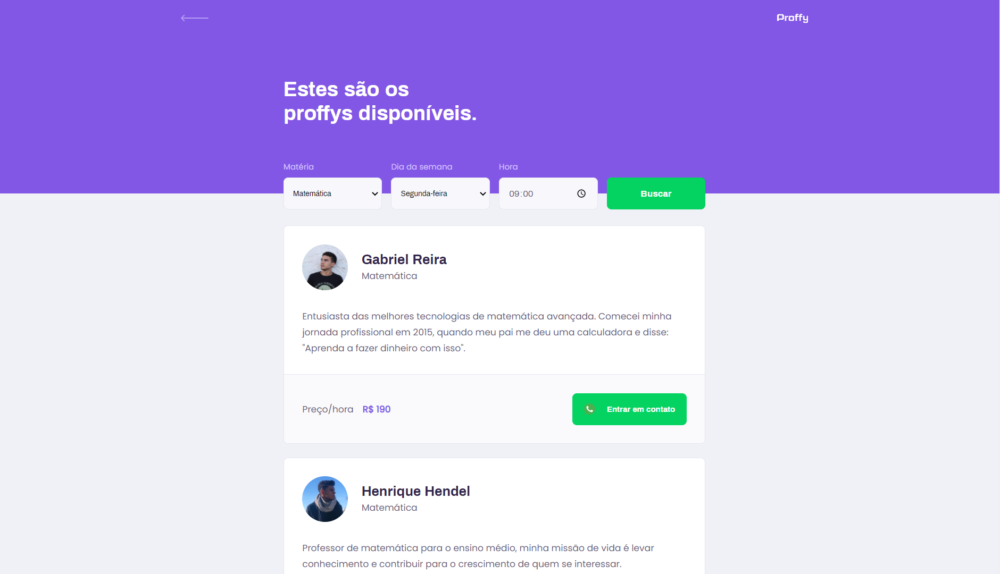
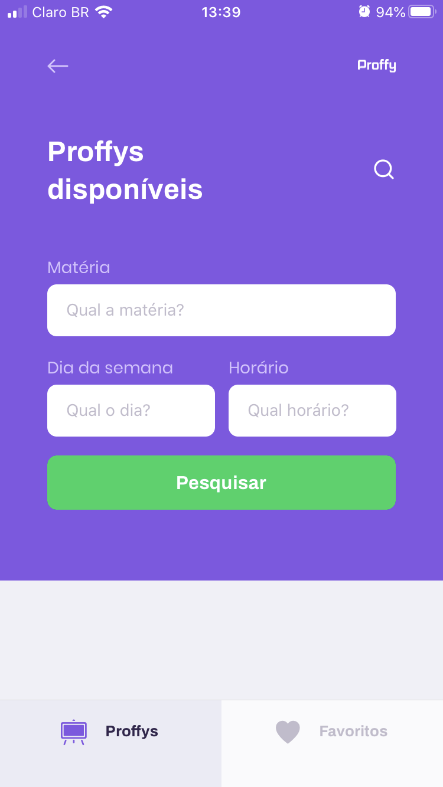

<h1 align="center">
    
</h1>
<h2 align="center">
   :books: NextLevelWeek 2.0 :books:
</h2>

  
  
  
  
  

 

---

## :computer: Sobre o projeto
### Informações gerais

Proffy é uma aplicação web e mobile que facilita a conexão entre alunos e professores.

Esta aplicação funciona de uma maneira bem simples: aos professores cabe a função de cadastrar suas aulas, adicionando informações como a disciplina, valor da hora/aula e seus horários disponívies; aos alunos basta pesquisar por uma matéria que está precisando de ajuda e pronto, em sua tela aparecerá os professores disponíveis e ele poderá entrar em contato com qualquer um de sua escolha.

Projeto desenvolvido na trilha <strong>OmniStack</strong> da <strong>Next Level Week</strong> organizada pela <a href="https://rocketseat.com.br/">Rocketseat</a>.

### Informações técnicas

  A construção de toda a interface foi feita de maneira responsiva e utilizando a metodologia Mobile First Design, onde cria-se primeiro a interface para dispositivos móveis e depois faz-se a adaptação para dispositivos com telas maiores. Esse método foi seguido porque hoje em dia a grande maioria das pessoas estão acessando os websites utilizando seu próprio smartphone e não mais os computadores, então é uma boa estratégia a se seguir.

  Construído à base de Single-Page Application (SPA), que é uma aplicação web ou website que interage com o usuário dinamicamente, fazendo com que a página atual não precise ser recarregada do zero toda vez que o usuário navega de uma tela para outra, evitando carregar novas páginas inteiras de um servidor.

  Back-end em Rest API.

  
---

## :rocket: Tecnologias utilizadas
### Front-end
* TypeScript
* ReactJS
* React Native
* HTML e CSS

### Back-end
* NodeJS
* Express
* Expo
* Knex
* SQLite
* Axios

---

## :framed_picture: Screenshots
### Web
<h1 align="center">
    
</h1>
<h1>
    
    
</h1>

### Mobile
<h1>
    
    
    
    
    
</h1>

---

## :scroll: Licença
Esse projeto está sob a licença MIT. Veja o arquivo [LICENSE](LICENSE.md) para mais detalhes.

---

<strong>Por <a href="https://www.linkedin.com/in/gabriel-reira-5a8a871a9/">Gabriel Reira</a></strong>

